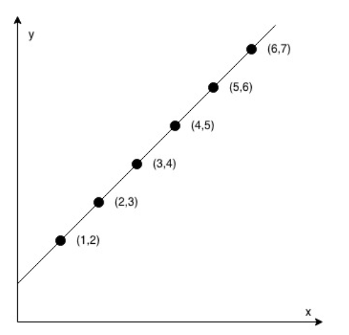
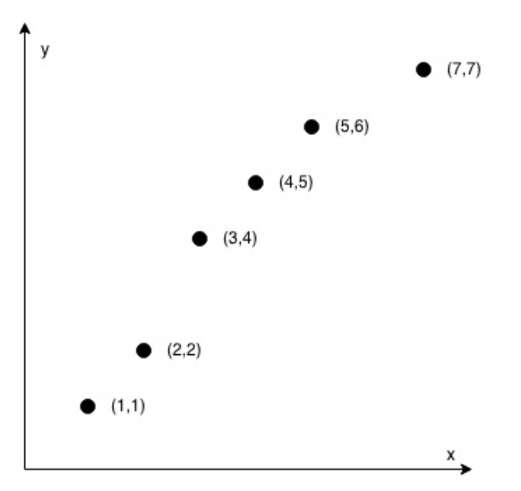

# Check If It Is a Straight Line
You are given an array coordinates, coordinates[i] = [x, y], where [x, y] represents the coordinate of a point. Check if these points make a straight line in the XY plane.

Example 1: 
 

Input: coordinates = [[1,2],[2,3],[3,4],[4,5],[5,6],[6,7]] 
Output: true

Example 2: 
 

Input: coordinates = [[1,1],[2,2],[3,4],[4,5],[5,6],[7,7]] 
Output: false
 

Constraints:
<ul>
<li>2 <= coordinates.length <= 1000</li>
<li>coordinates[i].length == 2</li>
<li>-10^4 <= coordinates[i][0], coordinates[i][1] <= 10^4</li>
<li>coordinates contains no duplicate point.</li>
</ul>